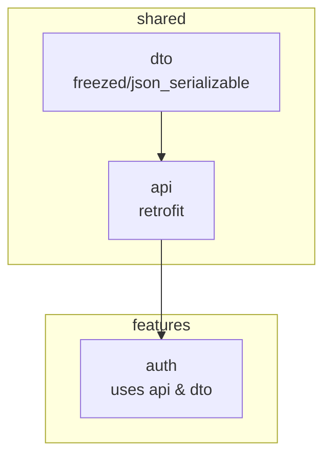
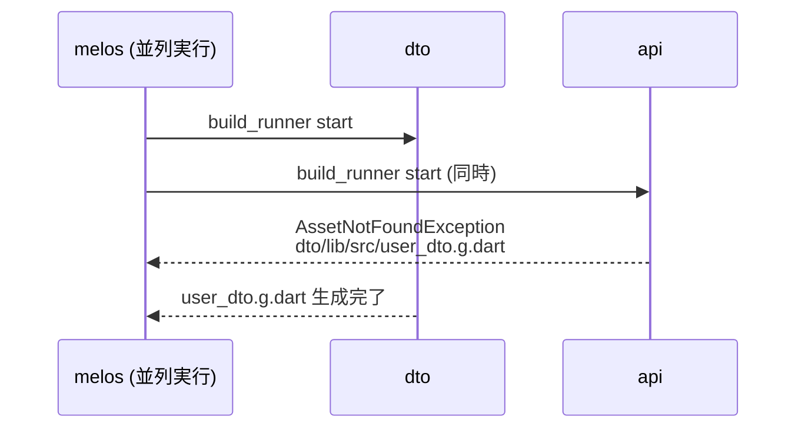
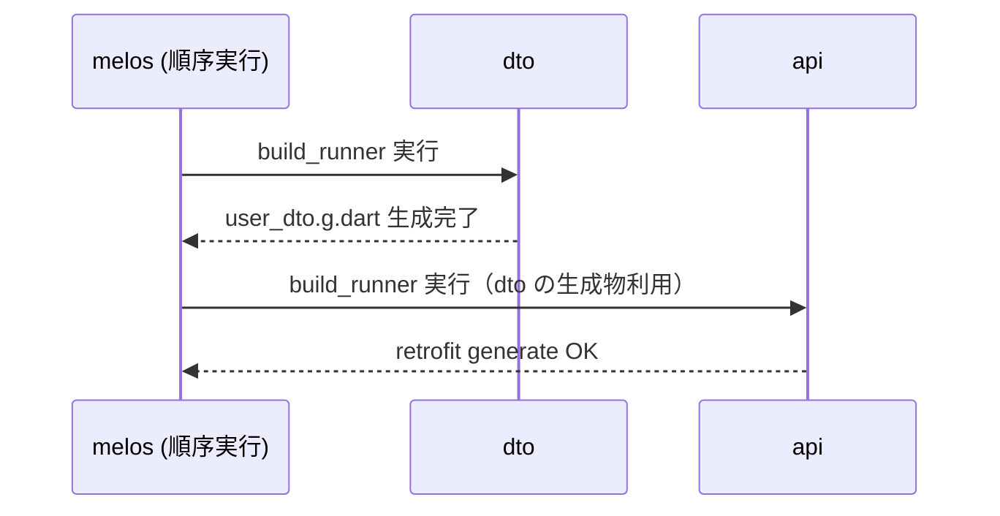

## 【Flutter】Melos + build_runner の依存関係順序問題と解決策

Flutter melos build_runner Dart json_serializable 

---

### はじめに
Melos を使って Flutter/Dart の monorepo 開発を行っていると、build_runner を用いたコード生成（freezed、json_serializable、retrofit など）で、依存関係の順序が原因でビルドエラーになることがあります。

本記事では、実際に発生した事例をもとに、原因と対策方法、そして Melos での安全なコード生成のベストプラクティス を紹介します。

### 発生した現象

#### プロジェクト構成（簡略図）
```bash
packages/
 ├─ shared/
 │   ├─ dto/            # モデル定義（freezed + json_serializable）
 │   ├─ api/            # Retrofit API 定義（dto を利用）
 │   └─ ...
 ├─ features/
 │   └─ auth/           # 認証モジュール（api/dto を利用）
```
#### 依存関係グラフ（dto → api → auth）

#### 実行コマンド
```bash
melos exec --depends-on=build_runner -- dart run build_runner build --delete-conflicting-outputs
```
#### 実行結果
```bash
api:
  E retrofit_generator on lib/user_api.dart:
  AssetNotFoundException: dto|lib/src/user_dto.g.dart

```
### 原因
api パッケージは dto パッケージに定義された UserDto を import している。

UserDto は part 'user_dto.g.dart' を持つため、解析時に user_dto.g.dart が必要。

しかし Melos が並列で全パッケージに build_runner を実行すると、dto の生成物がまだ存在しない状態で api の解析が始まり、AssetNotFoundException が発生する。

つまり 「依存するパッケージの生成物が先にできていない」 のが原因。
#### ❌ 失敗パターン（並列実行で爆死）


### 解決策
#### 1. 依存関係順序を守ってビルドする
Melos の scripts に順序付きの生成コマンドを用意します。
```yaml
scripts:
  gen:dto:
    run: melos exec --scope="dto" -- dart run build_runner build --delete-conflicting-outputs

  gen:api:
    run: melos exec --scope="api" -- dart run build_runner build --delete-conflicting-outputs

  gen:rest:
    run: melos exec --scope="auth,network_dio_retrofit" -- dart run build_runner build --delete-conflicting-outputs

  gen:all:
    run: |
      melos run gen:dto
      melos run gen:api
      melos run gen:rest

```
これで melos run gen:all を実行すれば、
dto → api → その他 の順で確実に生成されます。

##### 成功パターン（順序付き実行）


#### 2. 生成ファイルをリポジトリに含める
user_dto.freezed.dart や user_dto.g.dart を dto パッケージ内で生成してコミット しておけば、他のパッケージが参照しても即利用可能。

ただし、この方法は以下の注意が必要です：

* モデルを変更した場合、生成ファイルの更新も忘れないこと

* PR に生成ファイルの差分が大量に含まれる可能性あり
#### 3. Melos で build_runner 実行対象を絞る
select-package.depends-on を使い、build_runner を必要とするパッケージのみに限定。
```yaml
scripts:
  build:
    run: melos exec -- dart run build_runner build --delete-conflicting-outputs
    select-package:
      depends-on:
        - build_runner

```
これで無関係なパッケージまで実行されるのを防ぎ、失敗の連鎖を減らせます。

### ベストプラクティス
* 生成ファイルは原則として定義パッケージ内で作成・完結させる
他パッケージから .g.dart や .freezed.dart を直接 import しない。

* 依存関係の深い生成は順序制御する
Melos の scripts で順序付きビルドコマンドを作成。

* 開発効率を上げるために watch も依存順で実行
長時間の watch 実行でも依存パッケージの更新が先に反映されるようにする。

* 生成ファイルの commit ポリシーをチームで統一
提交するか否かは一貫性を保つ。

### まとめ

Melos + build_runner 環境では、依存パッケージの生成物がない状態で依存先をビルドすると失敗します。
順序制御や生成ファイルの管理方法を工夫すれば、安定してコード生成を行うことができます。

同じ問題に悩んでいる方は、ぜひ順序付き melos scripts の導入を試してみてください。

### Source Code
https://github.com/sayhellotogithub/poyopoyo_flutter/tree/dev