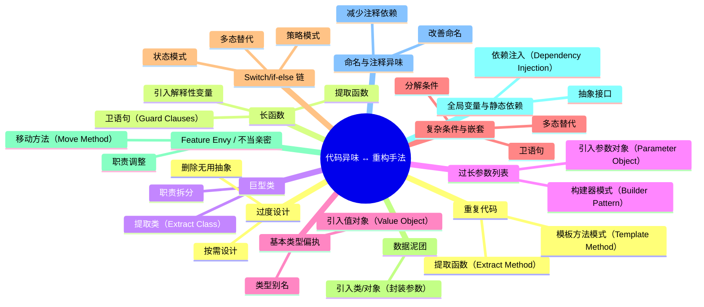
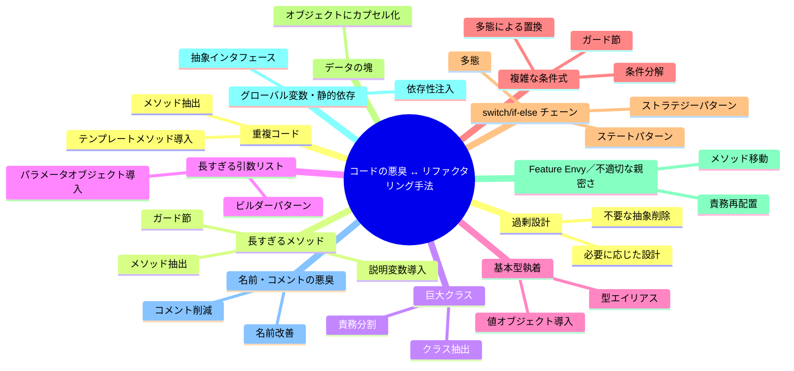
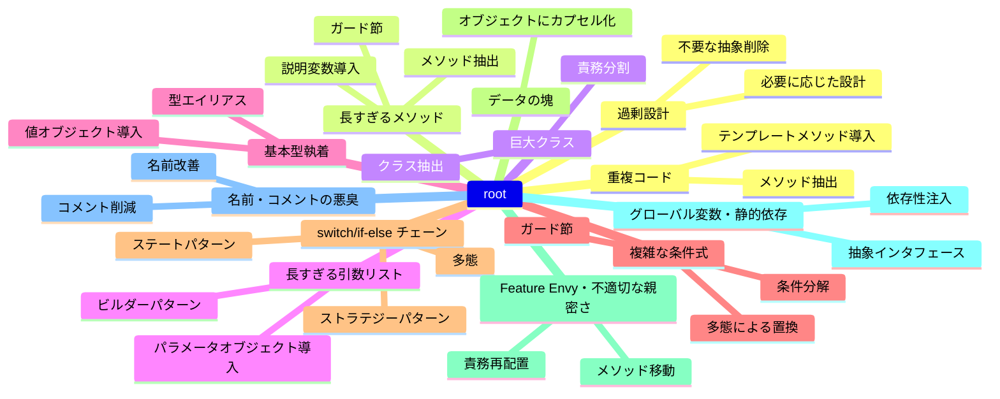

代码异味与重构手法速查表

## コードの悪臭とリファクタリング手法 対照表

| 代码异味（中文）        | コードの悪臭（日文）         | 重构手法（中文）                                            | リファクタリング手法（日文）                 |
| ----------------------- | ---------------------------- | ----------------------------------------------------------- | -------------------------------------------- |
| 重复代码                | 重複コード                   | 提取函数（Extract Method）、模板方法模式（Template Method） | メソッド抽出、テンプレートメソッド導入       |
| 长函数                  | 長すぎるメソッド             | 提取函数、引入解释性变量、卫语句                            | メソッド抽出、説明変数導入、ガード節         |
| 巨型类                  | 巨大クラス                   | 提取类（Extract Class）、职责拆分                           | クラス抽出、責務分割                         |
| 过长参数列表            | 長すぎる引数リスト           | 引入参数对象、构建器模式                                    | パラメータオブジェクト導入、ビルダーパターン |
| 基本类型偏执            | 基本型執着                   | 引入值对象（Value Object）、类型别名                        | 値オブジェクト導入、型エイリアス             |
| 复杂条件与嵌套          | 複雑な条件式                 | 分解条件、卫语句、多态替代                                  | 条件分解、ガード節、多態による置換           |
| Switch/if-else 链       | switch/if-else チェーン      | 策略模式、状态模式、多态替代                                | ストラテジーパターン、ステートパターン、多態 |
| 数据泥团                | データの塊                   | 引入类/对象（封装参数）                                     | オブジェクトにカプセル化                     |
| Feature Envy / 不当亲密 | Feature Envy／不適切な親密さ | 移动方法、职责调整                                          | メソッド移動、責務再配置                     |
| 全局变量与静态依赖      | グローバル変数・静的依存     | 依赖注入、抽象接口                                          | 依存性注入、抽象インタフェース               |
| 命名与注释异味          | 名前・コメントの悪臭         | 改善命名、减少注释依赖                                      | 名前改善、コメント削減                       |
| 过度设计                | 過剰設計                     | 删除无用抽象、按需设计                                      | 不要な抽象削除、必要に応じた設計             |

# コードの悪臭とリファクタリング手法 対照表

| コードの悪臭                 | リファクタリング手法                         |
| ---------------------------- | -------------------------------------------- |
| 重複コード                   | メソッド抽出、テンプレートメソッド導入       |
| 長すぎるメソッド             | メソッド抽出、説明変数導入、ガード節         |
| 巨大クラス                   | クラス抽出、責務分割                         |
| 長すぎる引数リスト           | パラメータオブジェクト導入、ビルダーパターン |
| 基本型執着                   | 値オブジェクト導入、型エイリアス             |
| 複雑な条件式                 | 条件分解、ガード節、多態による置換           |
| switch/if-else チェーン      | ストラテジーパターン、ステートパターン、多態 |
| データの塊                   | オブジェクトにカプセル化                     |
| Feature Envy／不適切な親密さ | メソッド移動、責務再配置                     |
| グローバル変数・静的依存     | 依存性注入、抽象インタフェース               |
| 名前・コメントの悪臭         | 名前改善、コメント削減                       |
| 過剰設計                     | 不要な抽象削除、必要に応じた設計             |

# コードの悪臭とリファクタリング手法 マインドマップ

------

### mermaid version 11.3.0

