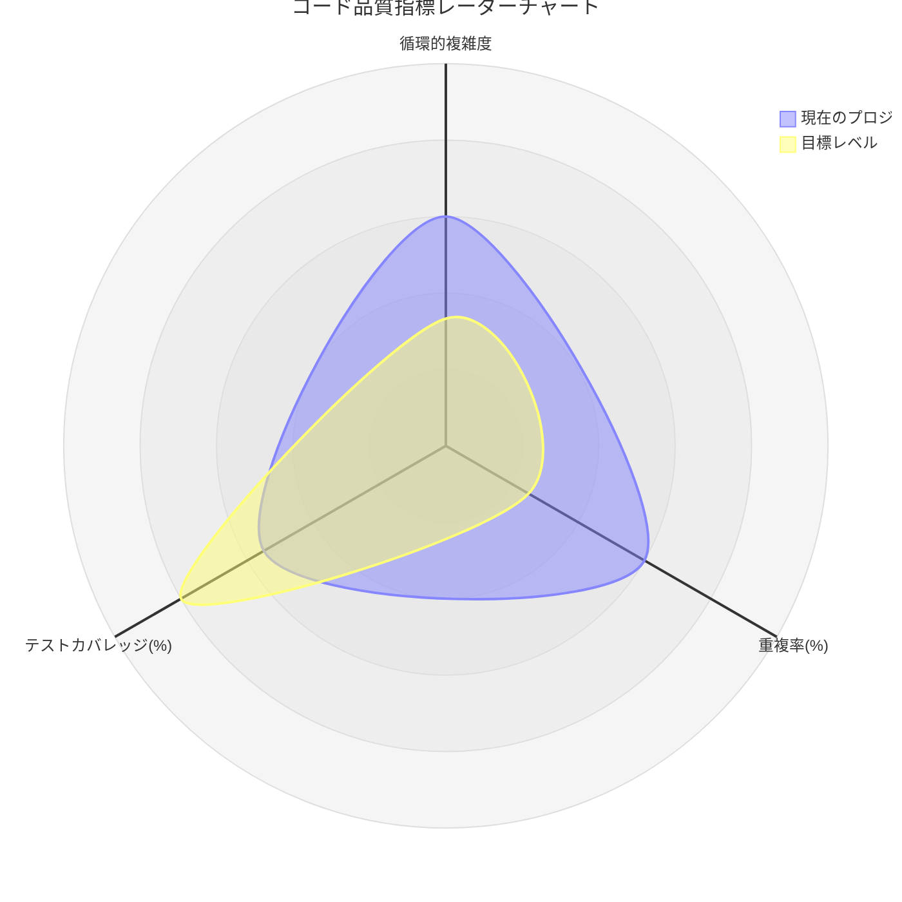

第13回　用度量指标发现异味（圈复杂度／重复率／静态分析工具）

## 第13回　用度量指标发现异味（圈复杂度／重复率／静态分析工具）

### 第13回　メトリクスで悪臭を発見する（循環的複雑度／重複率／静的解析ツール）

------

## 中文版

### 引言

代码异味很多时候靠直觉能发现，但在大规模系统中，单凭直觉往往不够。
 此时，**度量指标（Metrics）** 就是发现异味的重要辅助工具。
 本回介绍三种常见度量方法：

- **圈复杂度（Cyclomatic Complexity）**
- **重复率（Duplication Rate）**
- **静态分析工具（Static Analysis Tools）**

------

### 13.1 圈复杂度（Cyclomatic Complexity）

**定义**：衡量函数或方法中逻辑分支的数量。

- 每增加一个 `if` / `for` / `case`，复杂度 +1。
- 复杂度越高，函数越难理解和测试。

**示例**：

- 复杂度 ≤ 10：一般可控。
- 复杂度 11～20：较复杂，建议拆分。
- 复杂度 > 20：高风险，需要重构。

👉 工具支持：SonarQube、IntelliJ IDEA、ESLint（complexity 规则）等。

------

### 13.2 重复率（Duplication Rate）

**定义**：代码中重复片段的比例。

- 高重复率意味着维护成本大。
- 一个 Bug 可能要在多个地方重复修复。

**检测工具**：

- PMD/CPD（Java 等）
- SonarQube（跨语言）
- IntelliJ / VS Code 插件

**指标建议**：

- 重复率 > 5%：有优化空间。
- 重复率 > 10%：需要重构。

------

### 13.3 静态分析工具（Static Analysis Tools）

**作用**：自动扫描代码结构，发现潜在异味。

- **风格检查**：命名不规范、未使用变量。
- **复杂度检查**：圈复杂度过高。
- **依赖检查**：模块耦合过强。

**常见工具**：

- SonarQube（企业常用）
- detekt（Kotlin）
- dart analyze（Flutter/Dart）
- ESLint（JavaScript/TypeScript）
- Pylint/Flake8（Python）

------

### 小结

> **度量不是目的，而是信号。**

- 圈复杂度 → 判断逻辑是否需要拆分。
- 重复率 → 判断是否需要提取公共逻辑。
- 静态分析工具 → 提供自动化异味检测。

真正的目标是 **帮助我们发现异味 → 触发重构行动**。

------

## 日本語版

### 序文

コードの悪臭は直感でも気づけますが、大規模システムでは直感だけでは限界があります。
 そこで役立つのが **メトリクス（Metrics）** です。
 本回では代表的な3つの方法を紹介します：

- **循環的複雑度（Cyclomatic Complexity）**
- **重複率（Duplication Rate）**
- **静的解析ツール（Static Analysis Tools）**

------

### 13.1 循環的複雑度（Cyclomatic Complexity）

**定義**：関数やメソッド内の分岐数を測る指標。

- `if`／`for`／`case` などの分岐ごとに +1。
- 値が高いほど、理解・テストが難しくなる。

**目安**：

- 10以下：許容範囲。
- 11～20：複雑、分割を検討。
- 20以上：高リスク、リファクタリング必須。

👉 利用ツール：SonarQube、IntelliJ IDEA、ESLint（complexity ルール）など。

------

### 13.2 重複率（Duplication Rate）

**定義**：コードにおける重複部分の割合。

- 高い重複率は保守性を下げる。
- 1つのバグを複数箇所で修正する必要がある。

**検出ツール**：

- PMD/CPD（Java など）
- SonarQube（多言語対応）
- IntelliJ／VS Code プラグイン

**基準**：

- 5%以上：改善余地あり。
- 10%以上：リファクタリング推奨。

------

### 13.3 静的解析ツール（Static Analysis Tools）

**役割**：コードを自動スキャンし、潜在的な悪臭を検出。

- **スタイル検査**：命名規則、未使用変数。
- **複雑度検査**：循環的複雑度の超過。
- **依存関係検査**：モジュール結合度の高さ。

**代表的なツール**：

- SonarQube（企業利用が多い）
- detekt（Kotlin）
- dart analyze（Flutter/Dart）
- ESLint（JavaScript/TypeScript）
- Pylint／Flake8（Python）

------

### まとめ

> **メトリクスは目的ではなく、シグナルである。**

- 循環的複雑度 → ロジック分割の必要性を示す。
- 重複率 → 共通化の必要性を示す。
- 静的解析ツール → 自動で悪臭を検出。

本当の目的は **悪臭を発見し、リファクタリング行動につなげること** です。

## 📊 代码质量指标雷达图示例

------

### グラフの説明

- **循環的複雑度**：現在の平均は 18（高め）、目標は ≤ 10。
- **重複率**：現在は 12%（やや高い）、目標は ≤ 5%。
- **テストカバレッジ**：現在は 55%（不足）、目標は ≥ 80%。

------