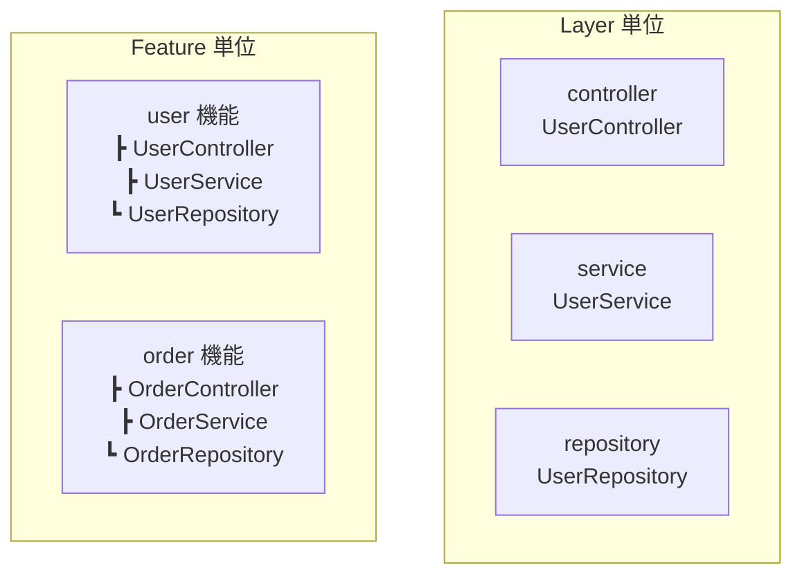

## 第22回　巨型模块拆分：Package by Feature vs Layer

### 第22回　巨大モジュール分割：Feature 単位 vs Layer 単位

------

## 中文版

### 引言

随着系统规模扩大，单一模块（如一个巨型 `core`、`service` 包）会迅速膨胀，成为“巨型类”的模块版。
 **模块级重构** 的关键问题是：如何组织包结构？
 常见两种方式：

- **按层拆分（Package by Layer）**
- **按功能拆分（Package by Feature）**

------

### 22.1 按层拆分（Package by Layer）

**特点**：

- 按照技术职责划分，如 `controller`、`service`、`repository`。
- 所有业务功能共用同一层次结构。

**示例结构**：

```
com.example.app
 ┣ controller
 ┃   ┗ UserController
 ┣ service
 ┃   ┗ UserService
 ┗ repository
     ┗ UserRepository
```

**优点**：

- 开发者容易理解，符合分层直觉。
- 新人上手快。

**缺点**：

- **横切依赖多**：功能分散在不同包里，难以独立维护。
- 功能级复用或重构时，需要跨层修改。

------

### 22.2 按功能拆分（Package by Feature）

**特点**：

- 按照业务功能模块化，如 `user`、`order`、`payment`。
- 每个功能模块内部再分层。

**示例结构**：

```
com.example.app
 ┣ user
 ┃   ┣ UserController
 ┃   ┣ UserService
 ┃   ┗ UserRepository
 ┣ order
 ┃   ┣ OrderController
 ┃   ┣ OrderService
 ┃   ┗ OrderRepository
```

**优点**：

- 功能边界清晰，**高内聚**。
- 更易于模块独立开发、测试和部署（适合微服务化）。

**缺点**：

- 对新人来说不如 Layer 直观。
- 如果功能过多，可能产生重复结构。

------

### 22.3 如何选择？

- **小型系统** → Layer 更直观。
- **中大型系统** → Feature 更利于演进。
- **混合模式** → 在顶层 Feature 拆分，内部仍可保持分层。

👉 最佳实践：**在 Clean Architecture 下，推荐 Package by Feature**，Domain 层抽象共享，具体实现按功能组织。

------

### 小结

- **Layer**：面向技术层，简单直观，但扩展性差。
- **Feature**：面向业务功能，高内聚，适合复杂系统。
   **核心思想**：让代码结构与业务功能对齐，而不仅仅是技术层次。

------

## 日本語版

### 序文

システムが大規模化すると、単一モジュール（巨大な `core` や `service` パッケージ）が肥大化し、「巨大クラス」のモジュール版になります。
 **モジュールレベルのリファクタリング** で重要なのは、パッケージ構造をどう整理するかです。
 代表的な方式は：

- **Layer 単位（技術層ごと）**
- **Feature 単位（機能ごと）**

------

### 22.1 Layer 単位（Package by Layer）

**特徴**：

- 技術的責務ごとに分割（`controller`、`service`、`repository` など）。
- すべての業務機能が同じ層構造を共有。

**例**：

```
com.example.app
 ┣ controller
 ┃   ┗ UserController
 ┣ service
 ┃   ┗ UserService
 ┗ repository
     ┗ UserRepository
```

**メリット**：

- 直感的で分かりやすい。
- 新人にとって学習コストが低い。

**デメリット**：

- **横断的依存が増える**：1つの機能が複数パッケージに分散。
- 機能単位の再利用やリファクタリングがしにくい。

------

### 22.2 Feature 単位（Package by Feature）

**特徴**：

- ビジネス機能ごとにモジュール化（`user`、`order`、`payment` など）。
- 各機能パッケージ内で層を分割。

**例**：

```
com.example.app
 ┣ user
 ┃   ┣ UserController
 ┃   ┣ UserService
 ┃   ┗ UserRepository
 ┣ order
 ┃   ┣ OrderController
 ┃   ┣ OrderService
 ┃   ┗ OrderRepository
```

**メリット**：

- 機能境界が明確で **高凝集**。
- モジュール単位で独立開発・テスト・デプロイしやすい（マイクロサービスに適合）。

**デメリット**：

- 新人には直感的でない場合がある。
- 機能が増えると同じような構造が繰り返される。

------

### 22.3 どちらを選ぶか？

- **小規模システム** → Layer 単位が分かりやすい。
- **中～大規模システム** → Feature 単位の方が進化しやすい。
- **ハイブリッド** → 上位は Feature 単位で分割し、内部は Layer を維持。

👉 ベストプラクティス：**Clean Architecture の考え方では Feature 単位を推奨**。Domain 層は共通抽象を持ち、実装は機能ごとにまとめる。

------

### まとめ

- **Layer**：技術層基準で直感的、だが拡張性に乏しい。
- **Feature**：業務機能基準で高凝集、大規模開発向け。
   **基本思想**：コード構造を技術ではなく **ビジネス機能に揃える** こと。


## 中文版：按层 vs 按功能

```
flowchart TB
    subgraph 按层拆分（Layer）
        A1[controller\nUserController]
        A2[service\nUserService]
        A3[repository\nUserRepository]
    end

    subgraph 按功能拆分（Feature）
        B1[user 模块\n ┣ UserController\n ┣ UserService\n ┗ UserRepository]
        B2[order 模块\n ┣ OrderController\n ┣ OrderService\n ┗ OrderRepository]
    end
```

**说明（中文）：**

- **按层拆分**：代码按技术层分类（所有控制器放一起、所有服务放一起），直观但耦合度高。
- **按功能拆分**：每个业务模块内部自带完整结构（Controller/Service/Repository），高内聚，适合中大型系统。

------

## 📊 日本語版：Layer vs Feature



**説明（日文）：**

- **Layer 単位**：技術層ごとに分類（コントローラはまとめて、サービスはまとめて）。理解しやすいが結合度が高い。
- **Feature 単位**：各ビジネス機能の中に Controller／Service／Repository を含める。高凝集で、中〜大規模システムに適している。

------

## 中文版：混合模式（Hybrid）

```
flowchart TB
    subgraph user 模块
        U1[controller\nUserController]
        U2[service\nUserService]
        U3[repository\nUserRepository]
    end

    subgraph order 模块
        O1[controller\nOrderController]
        O2[service\nOrderService]
        O3[repository\nOrderRepository]
    end

    subgraph shared 公共模块
        S1[domain\nUser]
        S2[domain\nOrder]
        S3[utils/infra]
    end
```

**说明（中文）：**

- **顶层按 Feature 拆分**：`user`、`order` 各自独立模块。
- **模块内部仍按 Layer 分层**：每个模块内部有 Controller / Service / Repository。
- **公共部分抽取 shared**：Domain 模型、工具类、基础设施统一放在 shared 中。

👉 适合 **中大型单体系统** 或 **逐步演进到微服务** 的项目。

------

## 📊 日本語版：ハイブリッド方式（Hybrid）

```
flowchart TB
    subgraph user 機能
        U1[controller\nUserController]
        U2[service\nUserService]
        U3[repository\nUserRepository]
    end

    subgraph order 機能
        O1[controller\nOrderController]
        O2[service\nOrderService]
        O3[repository\nOrderRepository]
    end

    subgraph shared 共通モジュール
        S1[domain\nUser]
        S2[domain\nOrder]
        S3[utils/infra]
    end
```

**説明（日文）：**

- **上位は Feature 単位**：`user`、`order` が独立したモジュール。
- **モジュール内部は Layer 構造**：各モジュールに Controller／Service／Repository を配置。
- **共通部分は shared に抽出**：ドメインモデル・ユーティリティ・インフラを共通化。

👉 **中〜大規模モノリシックシステム** や **マイクロサービス移行前段階** に有効。