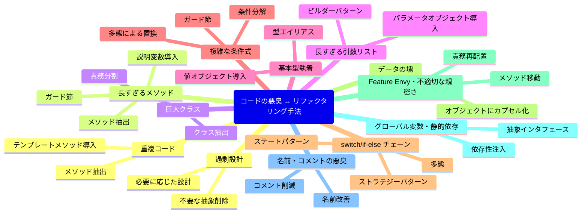
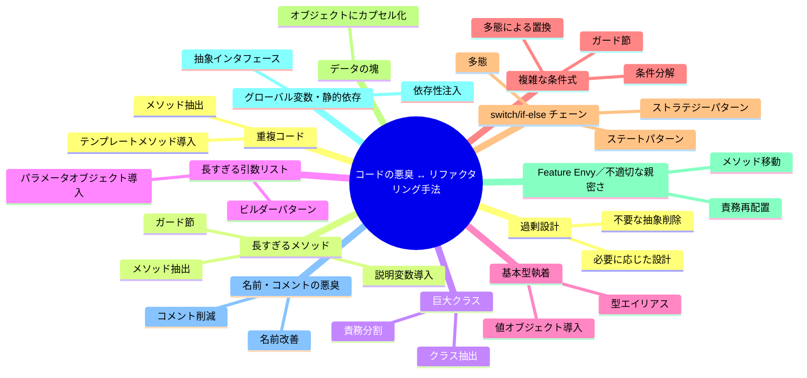

## 第6回　常见代码异味总览

### 第6回　コードの悪臭一覧

------

### 中文版

#### 引言

代码的质量好坏，往往不是由“能不能运行”决定，而是由“能不能维护”决定。
 **代码异味（Code Smell）** 指的是代码结构中一些“潜在问题的信号”，虽然它们不一定马上导致错误，但会增加未来维护与扩展的难度。

理解常见的异味，可以帮助我们在日常开发中快速识别问题，并选择合适的重构手法。

------

#### 3.1 重复代码（Duplicated Code）

- **现象**：同样的逻辑片段出现在多个地方。
- **问题**：修改时需要多处同步，容易遗漏。
- **重构方向**：提取函数、引入模板方法模式。

#### 3.2 长函数（Long Method）

- **现象**：一个函数几十行甚至上百行。
- **问题**：难以理解，修改风险大。
- **重构方向**：提取函数、卫语句、早退。

#### 3.3 巨型类（Large Class）

- **现象**：一个类承担过多职责。
- **问题**：低内聚，高耦合，难以测试。
- **重构方向**：提取类、职责拆分。

#### 3.4 过长参数列表（Long Parameter List）

- **现象**：函数参数超过4个甚至更多。
- **问题**：调用复杂，易出错。
- **重构方向**：引入参数对象、构建器模式。

#### 3.5 基本类型偏执（Primitive Obsession）

- **现象**：用基本类型（String/Int/Double）表示复杂概念。
- **问题**：语义不清晰，约束缺失。
- **重构方向**：引入值对象（Value Object）。

#### 3.6 复杂条件与嵌套（Complex Conditional）

- **现象**：多层 if/else 或复杂的布尔表达式。
- **问题**：逻辑混乱，可读性差。
- **重构方向**：分解条件、卫语句、多态替代。

#### 3.7 Switch/if-else 链

- **现象**：同一条件逻辑在不同地方多次出现。
- **问题**：违反开放封闭原则，修改困难。
- **重构方向**：用多态或策略模式。

#### 3.8 数据泥团（Data Clumps）

- **现象**：一组总是同时出现的参数/字段。
- **问题**：增加耦合度。
- **重构方向**：封装为对象。

#### 3.9 Feature Envy / 不当亲密（Inappropriate Intimacy）

- **现象**：某个类频繁访问另一个类的内部数据。
- **问题**：过度耦合，违反封装。
- **重构方向**：移动方法、职责调整。

#### 3.10 全局变量与静态依赖

- **现象**：大量使用全局状态或静态方法。
- **问题**：难以测试，副作用不可控。
- **重构方向**：依赖注入、抽象接口。

#### 3.11 命名与注释的异味

- **现象**：命名含糊，需要大量注释解释。
- **问题**：代码可读性差。
- **重构方向**：改进命名，减少注释依赖。

#### 3.12 过度设计（Speculative Generality）

- **现象**：为未来需求准备了过度抽象。
- **问题**：增加复杂性，维护成本高。
- **重构方向**：删除无用抽象，按需设计。

------

#### 小结

代码异味 ≠ Bug，但它们是未来问题的 **预警信号**。
 学会识别这些信号，就是迈向高质量代码的第一步。

------

### 日本語版

#### はじめに

コードの良し悪しは「動くかどうか」ではなく、「保守できるかどうか」で決まります。
 **コードの悪臭（Code Smell）** とは、コード構造に潜む「潜在的な問題の兆候」を指します。すぐにエラーを引き起こすわけではありませんが、将来的な保守や拡張の難易度を高めます。

代表的な悪臭を理解することで、日々の開発で問題を素早く察知し、適切なリファクタリング手法を選択できるようになります。

------

#### 6.1 重複コード（Duplicated Code）

- **現象**：同じロジックが複数箇所に現れる。
- **問題**：修正時に複数箇所を同期する必要があり、漏れやすい。
- **リファクタリング**：メソッド抽出、テンプレートメソッドの導入。

#### 6.2 長すぎるメソッド（Long Method）

- **現象**：1つのメソッドが数十行～数百行。
- **問題**：理解しにくく、修正リスクが大きい。
- **リファクタリング**：メソッド抽出、ガード節、早期リターン。

#### 6.3 巨大クラス（Large Class）

- **現象**：1つのクラスが多すぎる責務を持つ。
- **問題**：低凝集・高結合でテストが困難。
- **リファクタリング**：クラス抽出、責務分割。

#### 6.4 長すぎる引数リスト（Long Parameter List）

- **現象**：引数が4つ以上。
- **問題**：呼び出しが複雑でミスしやすい。
- **リファクタリング**：パラメータオブジェクトの導入、ビルダーパターン。

#### 6.5 基本型執着（Primitive Obsession）

- **現象**：文字列や数値で複雑な概念を表す。
- **問題**：意味が曖昧で制約不足。
- **リファクタリング**：値オブジェクトの導入。

#### 6.6 複雑な条件式（Complex Conditional）

- **現象**：入れ子の if/else や複雑なブール式。
- **問題**：ロジックが不明瞭で読みづらい。
- **リファクタリング**：条件分解、ガード節、多態による置換。

#### 6.7 switch/if-else チェーン

- **現象**：同じ条件分岐が複数箇所で繰り返される。
- **問題**：オープン・クローズド原則に違反し、変更に弱い。
- **リファクタリング**：多態またはストラテジーパターンに置換。

#### 6.8 データの塊（Data Clumps）

- **現象**：常に一緒に現れる引数やフィールド。
- **問題**：結合度を高める。
- **リファクタリング**：オブジェクトにカプセル化。

#### 6.9 Feature Envy / 不適切な親密さ

- **現象**：あるクラスが他クラスの内部データを過度に参照。
- **問題**：結合度が高く、カプセル化が崩れる。
- **リファクタリング**：メソッドの移動、責務の再配置。

#### 6.10 グローバル変数・静的依存

- **現象**：グローバル状態や静的メソッドに依存。
- **問題**：テスト困難、副作用が制御できない。
- **リファクタリング**：依存性注入、抽象インタフェース。

#### 6.11 名前・コメントの悪臭

- **現象**：名前が曖昧で、コメントがなければ理解できない。
- **問題**：可読性が低い。
- **リファクタリング**：名前の改善、コメント削減。

#### 6.12 過剰設計（Speculative Generality）

- **現象**：将来のために必要以上の抽象を用意。
- **問題**：複雑さが増し、メンテナンスコストが高い。
- **リファクタリング**：不要な抽象の削除、必要に応じた設計。

------

#### まとめ

コードの悪臭は = バグではありません。
 しかし、それは将来の問題を示す **警告サイン** です。
 これらを嗅ぎ分けられることが、良いコードへの第一歩です。

#### 附録 コードの悪臭とリファクタリング手法 マインドマップ

------
https://qiita.com/nozomi2025/items/a07badb27093ab806839

### コードの悪臭とリファクタリング手法 マインドマップ

------

