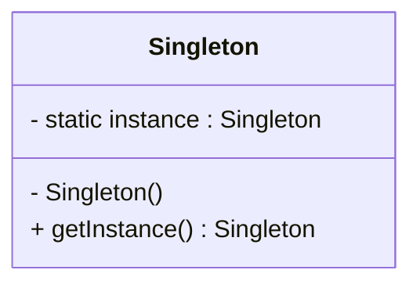
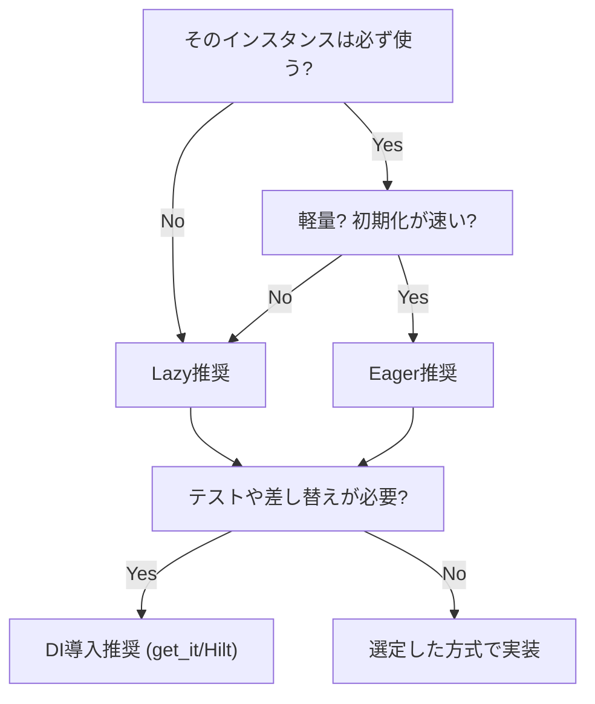

## 【デザインパターン】シングルトンパターン解説（Flutter / Android 実例付き）

デザインパターン Flutter Kotlin singleton DesignPatterns 

### 1. パターンの意図

**シングルトン（Singleton）** は、あるクラスのインスタンスを **アプリ全体で一つだけ** に制限し、どこからでもアクセス可能にする設計パターンです。

#### 解決する問題

- 設定やDB接続のように、複数生成すると不具合やリソース浪費になるケース
- グローバル変数を避けつつ「制御された唯一性」を確保したいケース

 **ポイント**

- インスタンスは1度だけ生成
- 外部から `new` できないようにする
- 必要に応じて「遅延生成」や「スレッドセーフ」も考慮

------

### 2. UML 図



------

### 3. Flutter / Dart 実装例

#### 3.1 即時生成版（Eager Singleton）

アプリ起動時にインスタンスが生成される。
 軽量・必須のリソースに適している。

```dart
class AppConfig {
  AppConfig._internal();

  static final AppConfig _instance = AppConfig._internal();

  factory AppConfig() => _instance;

  String baseUrl = "https://api.example.com";
}
```

------

#### 3.2 遅延生成版（Lazy Singleton）

実際に必要になるまで生成しない。
 重いオブジェクトや条件付きリソースに適している。

```dart
class AppConfig {
  AppConfig._internal();

  static AppConfig? _instance;

  factory AppConfig() {
    _instance ??= AppConfig._internal();
    return _instance!;
  }

  String baseUrl = "https://api.example.com";
}
```

------

### 4. Android / Kotlin 実装例

#### 4.1 即時生成（`object` キーワード）

```kotlin
object AppConfig {
    var baseUrl: String = "https://api.example.com"
}
```

------

#### 4.2 遅延生成（`by lazy`）

```kotlin
class AppConfig private constructor() {
    companion object {
        val instance: AppConfig by lazy { AppConfig() }
    }

    var baseUrl: String = "https://api.example.com"
}
```

------

### 5. 比較まとめ

| 観点             | 即時生成（Eager）  | 遅延生成（Lazy）        |
| ---------------- | ------------------ | ----------------------- |
| 初期化タイミング | アプリ起動時       | 初回アクセス時          |
| 実装の簡単さ     | ◎ とても簡単       | ○ 多少複雑              |
| メモリ効率       | △ 未使用でも常駐   | ○ 使わなければ未生成    |
| テスト性         | △ 状態リセット必要 | △ 差し替え注意          |
| 典型ユースケース | Logger, Config     | DB, キャッシュ, 重いAPI |


------
### 6. Flutter / Android 実装時の注意点
#### Flutter（Dart）での注意点

  - **Isolate** を跨ぐと「同一プロセス内の“唯一性”」が前提崩れ：
    - メイン Isolate とバックグラウンド Isolate に**別インスタンス**が立つことがある
    -  “真の唯一性”が必要なら **共有リソースの設計（専用サービス/IPC/DBロック）** を検討
  - **Widget テスト**ではシングルトンの**状態リセット**を用意すると安定（例：`resetForTest()`）
  - ランタイム差し替えやモックが必要なら **`get_it` で登録/解除** できるようにするのが◎

#### Android（Kotlin）での注意点

  - `object` は **JVM 単位で1インスタンス**：マルチプロセス構成ではプロセスごとに別物
  - `by lazy` は **スレッドセーフ（デフォルト）** だが、明示的に `LazyThreadSafetyMode` を選ぶ設計が安心
  - `Room` や `OkHttpClient` は基本 **アプリ内で共有**。ただしテストでは **DI（Hilt/Koin）で差し替え** 前提にするとよい

------

### 7. 実務ユースケース

#### Flutter

- `Dio` クライアント
- `SharedPreferences` 管理クラス
- `Drift` / `sqflite` データベース

#### Android (Kotlin)

- `Retrofit` API クライアント
- `Room` データベース
- `OkHttpClient`

------

### 8. アンチパターンとの比較

- **グローバル変数**
  - 制御できないアクセス → 依存が散乱
  - シングルトンは「制御された唯一性」
- **依存性注入（DI）**
  - シングルトンを置き換えるモダン手法
  - Flutter → `get_it`, `Riverpod`
  - Android → `Hilt`, `Koin`
  - 実務では「DI コンテナ経由でシングルトン管理」が推奨されるケースが多い

------

### 9. テスト戦略

- **状態を持たないシングルトン** → テストしやすい
- **状態を持つシングルトン** → テスト前後にリセットが必要
- DI と組み合わせて、モック差し替えを可能にするのがベスト

------

### 10. どちらを選ぶべきか？ 実務指針

#### 結論

- **軽量 & 必須** → 即時生成（Eager）
- **重い or 条件付き** → 遅延生成（Lazy）
- **テスト性や差し替え** → DI コンテナで管理

------

#### 選定フロー



------


### まとめ

- シングルトンは「唯一性が必要なオブジェクト管理」に有効
- Flutter / Android の両方で **設定・DB・ネットワーククライアント** に多用される
- **即時 or 遅延 or DI** の選択は、リソースの重さ・利用頻度・テスト性で判断
- 実務では「DI コンテナと組み合わせて使う」のがベストプラクティス